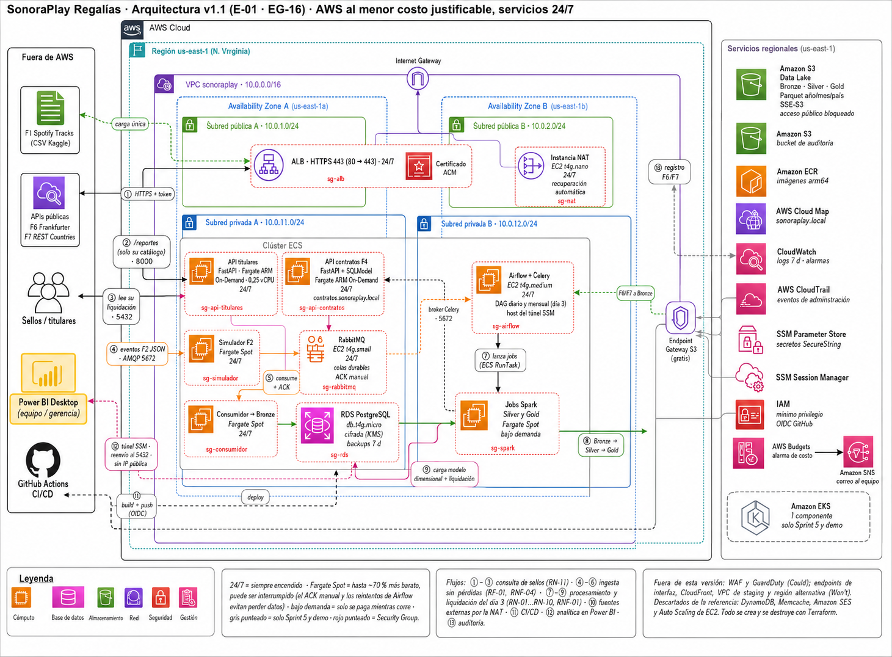

# Arquitectura v1 · SonoraPlay Regalías

> Entregable E-01 v1 (revisión 1.1, 5 de octubre de 2026) · Tarea 07 (EG-16) · Sprint 1 · Épica EP-9
>
> Responsables: los tres integrantes (lidera Joshua) · Estado: propuesta para revisión del equipo
>
> Decisión formal: [ADR-0001](../adr/0001-arquitectura-base-aws.md)

Fuente editable: `sonoraplay-arquitectura-v1.drawio`. Se abre en [diagrams.net](https://app.diagrams.net) o con la extensión Draw.io de VS Code.

## 1. Principios de diseño

1. Servicios 24/7 y lotes bajo demanda. Todo lo que atiende peticiones o recibe eventos queda encendido: las APIs, RabbitMQ, Airflow y RDS. Spark no es un servicio. Airflow lanza cada job, el job corre y se apaga, así que está desplegado siempre pero solo se paga mientras procesa.
2. Menor costo justificable. Para cada necesidad se elige el servicio más barato que cumple un tema obligatorio, una regla de negocio (RN), un requisito (RF/RNF) o un criterio de aceptación (CA).
3. Solo el ALB es público. El cómputo y los datos van en subredes privadas. El equipo entra con SSM Session Manager, sin bastión y sin puertos abiertos hacia internet.
4. Ningún secreto en el código. Los secretos viven en SSM Parameter Store y GitHub entra a AWS con OIDC. Una credencial expuesta cuesta −15 %.
5. Todo se crea y se destruye con Terraform. No destruir la infraestructura después de la demo cuesta −10 %.
6. Cifrado y auditoría desde el inicio. RDS y S3 se cifran en reposo, el ALB solo acepta HTTPS y CloudTrail registra cada acción sobre la cuenta.

## 2. Servicios elegidos

| Capa | Servicio | Tamaño / modo | Estado | Por qué | Trazabilidad |
|---|---|---|---|---|---|
| Red | VPC con 2 AZ, subredes públicas y privadas, Internet Gateway | 10.0.0.0/16 | 24/7 | Aislamiento; el ALB y el grupo de subredes de RDS exigen 2 AZ | Tema 6 · HU 17 |
| Salida | Instancia NAT | EC2 t4g.nano, sin verificación de origen/destino | 24/7 | Cerca de 90 % más barata que un NAT Gateway. Por ella salen F6/F7, las descargas de imágenes de ECR, los logs a CloudWatch y las sesiones de SSM | Tema 6 · ADR-0010 |
| Salida a S3 | Endpoint Gateway de S3 | — | 24/7 | Gratis; el tráfico a S3 no pasa por la NAT | Tema 7 |
| Entrada | Application Load Balancer | 1 ALB en las 2 subredes públicas | 24/7 | Health checks y punto único de entrada. El puerto 80 redirige al 443 | Tema 9 · HU 18 |
| Certificado | AWS Certificate Manager (ACM) | 1 certificado en el ALB | Siempre | Los certificados públicos de ACM son gratis. Si el equipo no tiene dominio, se importa uno autofirmado y se documenta | CA-08 · HU 18 |
| API de titulares | ECS Fargate On-Demand, ARM64 | 0,25 vCPU / 0,5 GB | 24/7 | Sin servidores que administrar; On-Demand porque atiende a los sellos | RF-05, RN-11, CA-08 · HU 12, 18 |
| API de contratos F4 | ECS Fargate On-Demand, ARM64 | 0,25 vCPU / 0,5 GB | 24/7 | Spark la consulta para obtener el % vigente. No pasa por el ALB: se llama por DNS privado | F4, RN-07 · HU 11 |
| Descubrimiento interno | AWS Cloud Map (ECS Service Discovery) | Espacio de nombres privado `sonoraplay.local` | 24/7 | Spark encuentra la API F4 sin exponerla a internet | F4 · HU 11 |
| Simulador F2 | ECS Fargate Spot | 0,25 vCPU / 0,5 GB | 24/7 | Hasta ~70 % más barato; si AWS lo interrumpe, se reinicia | F2, CT-06 · HU 10 |
| Consumidor → Bronze | ECS Fargate Spot | 0,25 vCPU / 0,5 GB | 24/7 | Con ACK manual, un mensaje sin confirmar vuelve a la cola, así que una interrupción no pierde datos | RF-01, RNF-04 · HU 20, 24 |
| Mensajería | RabbitMQ en EC2 | t4g.small | 24/7 | Más barato que Amazon MQ; también es el broker de Celery | Tema 10 · ADR-0013 |
| Orquestación | Airflow (CeleryExecutor) en EC2 con docker compose | t4g.medium | 24/7 | MWAA cuesta cientos de USD al mes. Esta EC2 también sirve de host de salto para el túnel SSM hacia RDS | Temas 11–12 · ADR-0015 |
| Procesamiento | Spark en tareas ECS Fargate Spot | 2 vCPU / 8 GB por job | Bajo demanda | Solo se paga mientras corre; Airflow reintenta si AWS interrumpe la tarea | Temas 13–16 · RNF-01 |
| Data Lake | Amazon S3 Bronze / Silver / Gold | Parquet por año/mes/país, SSE-S3, acceso público bloqueado | Siempre | Barato y durable; trazabilidad por capas | Tema 7 · RNF-03 · ADR-0014 |
| Base de datos | RDS PostgreSQL | db.t4g.micro, Single-AZ, 20 GB gp3, cifrada con KMS (clave administrada por AWS), backups de 7 días | 24/7 | F3, contratos, modelo dimensional y liquidaciones append-only. El cifrado se activa al crearla porque después no se puede | Tema 7 · RF-09 · HU 17 |
| Imágenes | Amazon ECR | arm64 | Siempre | Destino del CI; una imagen por componente | Tema 8 |
| Secretos | SSM Parameter Store (SecureString) | Nivel estándar | Siempre | Gratis; evita credenciales en el repositorio | CT-02 · ADR-0017 |
| Observabilidad | CloudWatch Logs y alarmas | Retención de 7 días | Siempre | Logs de ECS y del ALB, alarmas de salud y recuperación automática de la NAT | HU 18 |
| Auditoría | AWS CloudTrail | 1 trail de eventos de administración hacia un bucket S3 de auditoría | Siempre | Registra quién hizo qué en la cuenta. La primera copia de eventos de administración es gratis; solo se paga el almacenamiento en S3 | CT-02 · HU 31 |
| Costos | AWS Budgets + SNS por correo | 1 presupuesto | Siempre | Avisa antes de pasarse del presupuesto | HU 23 · E-07 |
| Kubernetes | Amazon EKS | 1 componente | Solo Sprint 5 y demo | El plano de control cuesta ~73 USD al mes | Tema 19 · ADR-0018 |
| Infraestructura como código | Terraform | — | — | `apply` y `destroy` reproducibles | HU 17, 38 · ADR-0011 |
| CI/CD | GitHub Actions + OIDC | — | — | Lint, pruebas, build, push a ECR y deploy en ECS, sin llaves guardadas | Temas 17–18 · HU 31 |
| Analítica | Power BI Desktop por túnel SSM a RDS | — | — | La base de datos nunca queda expuesta a internet | RF-08 · HU 35 · ADR-0019 |

## 3. Security Groups

Cada Security Group solo acepta tráfico de otro Security Group, nunca de un rango abierto, salvo el del ALB. El puerto 8000 corresponde a uvicorn por defecto; si el equipo cambia el puerto en Terraform, se actualiza esta tabla.

| Security Group | Entrada permitida | Desde |
|---|---|---|
| `sg-alb` | 443 (y 80 para redirigir) | 0.0.0.0/0 |
| `sg-api-titulares` | 8000 | `sg-alb` |
| `sg-api-contratos` | 8000 | `sg-spark` |
| `sg-rds` | 5432 | `sg-api-titulares`, `sg-api-contratos`, `sg-spark`, `sg-airflow` (host del túnel) |
| `sg-rabbitmq` | 5672 (AMQP) | `sg-simulador`, `sg-consumidor`, `sg-airflow` |
| `sg-airflow` | Ninguna | La interfaz web se abre por túnel SSM |
| `sg-nat` | Todo el tráfico | 10.0.0.0/16 (solo la VPC) |
| `sg-spark`, `sg-simulador`, `sg-consumidor` | Ninguna | Solo hacen conexiones de salida |

## 4. Flujos (números del diagrama)

| # | Flujo | Reglas que cubre |
|---|---|---|
| ①–③ | El sello llama por HTTPS con su token al ALB, el ALB lo envía a la API de titulares y la API lee su liquidación en RDS. Si pide datos de otro titular, recibe 403 | RN-11, CA-08, RF-05 |
| ④–⑥ | El simulador publica eventos F2 en RabbitMQ (cola durable, mensaje persistente). El consumidor escribe en S3 Bronze y después confirma con ACK | RF-01, RNF-04 |
| ⑦ | Airflow lanza los jobs de Spark con ECS RunTask: el diario (Silver) y el mensual del día 3 (Gold) | RF-04 |
| ⑧ | Spark transforma Bronze en Silver (sesiones, validez, fraude) y Silver en Gold (liquidación). Consulta el % vigente en la API F4 por DNS privado | RN-01 a RN-08, RN-10 |
| ⑨ | Spark carga en RDS el modelo dimensional y la liquidación (append-only, con ID de liquidación por reproducción) | RNF-02, RNF-03, RF-09 |
| ⑩ | Airflow trae F6 (tasas) y F7 (países) por la NAT y los guarda en S3 Bronze | RN-05 |
| ⑪ | GitHub Actions construye las imágenes, las sube a ECR y despliega los servicios en ECS (OIDC, sin llaves) | CT-02 |
| ⑫ | Power BI Desktop abre un túnel SSM hacia la EC2 de Airflow, que reenvía el puerto 5432 a RDS | RN-09, RF-07, RF-08 |
| ⑬ | CloudTrail registra las acciones sobre la cuenta en el bucket de auditoría | CT-02 |

F1 (CSV de Kaggle) se carga una sola vez en S3 Bronze y no lleva número.

## 5. Qué se tomó y qué se descartó de la arquitectura de referencia

| En la imagen de referencia | En SonoraPlay | Motivo |
|---|---|---|
| Elastic Load Balancer | Se mantiene (ALB) | Lo exige el tema 9 |
| EC2 + Auto Scaling Group | Se reemplaza por ECS Fargate | No hay servidores que parchear; se paga por contenedor |
| RDS con backups | Se mantiene | Tema 7; backups automáticos de 7 días |
| Amazon S3 | Se mantiene como Data Lake | Tema 7 |
| Email Notifications | Se mantiene como Budgets + SNS | Alertas de costo y de salud |
| DynamoDB (sesiones) | Se descarta | La API no guarda sesión: usa un token firmado |
| Memcache | Se descarta | Ningún requisito pide caché; sería un costo sin regla que lo justifique |
| Amazon SES | Se descarta | No se envían correos a los sellos; para alertas basta SNS |

## 6. Elementos de una arquitectura completa que esta versión no incluye

La guía de diagramas de infraestructura de Hackmetrix lista diez elementos. SonoraPlay cubre la red, la entrada segura, el cómputo, los datos, el monitoreo, la gestión de seguridad y el desarrollo. Lo que queda fuera está priorizado con MoSCoW:

| Elemento | Prioridad | Motivo |
|---|---|---|
| AWS WAF en el ALB | Could | Cuesta unos 5 USD al mes más las reglas y ningún requisito lo pide |
| Amazon GuardDuty | Could | Tiene 30 días de prueba gratis; se puede activar solo para la demo |
| VPC endpoints de interfaz (ECR, Logs, SSM) | Won't | Quitarían la dependencia de la NAT, pero cuestan unos 7 USD al mes cada uno por AZ |
| CloudFront para contenido estático | Won't | SonoraPlay no sirve un sitio web |
| VPC de staging | Won't | El entorno local con Docker cumple ese papel |
| Región alternativa (recuperación ante desastres) | Won't | Fuera del alcance de un proyecto académico de 6 semanas; los backups de RDS y la durabilidad de S3 cubren la pérdida de datos |

## 7. Costo estimado con todo prendido

Supuestos: región us-east-1, 730 horas al mes, precios de lista de referencia y volumen de desarrollo. Hay que confirmarlo en la HU 23 con la AWS Pricing Calculator.

| Componente | USD/mes aprox. |
|---|---|
| Instancia NAT t4g.nano + disco | 4 |
| EC2 RabbitMQ t4g.small + 20 GB | 14 |
| EC2 Airflow t4g.medium + 30 GB | 27 |
| RDS db.t4g.micro + 20 GB | 14 |
| ALB (hora + LCU) | 18 |
| 2 APIs en Fargate ARM On-Demand | 15 |
| Simulador y consumidor en Fargate Spot | 5 |
| IPv4 públicas (2 del ALB + 1 de la NAT) | 11 |
| Jobs Spark en Spot (diarios + mensual) | 2–5 |
| S3, ECR, CloudWatch, SNS, Budgets | 4–6 |
| Cloud Map + zona DNS privada, CloudTrail (almacenamiento), ACM, KMS | 1 |
| **Total sin EKS** | **≈ 115–120** |
| EKS, solo en el Sprint 5 y la demo (~2 semanas) | +35 del plano de control, más los nodos |

Los rubros que más pesan son el ALB, la EC2 de Airflow y RDS. Bajarlos exigiría apagar servicios, y eso va contra el requisito de mantener todo prendido.

## 8. Riesgos de esta versión

| Riesgo | Mitigación |
|---|---|
| La instancia NAT es un punto único de falla. Si cae, las tareas de ECS no pueden descargar imágenes nuevas, los logs no llegan a CloudWatch, el túnel SSM no abre y no entran F6/F7 | Alarma de CloudWatch con recuperación automática de la instancia. El tráfico a S3 sigue por el endpoint gratuito. Los endpoints de interfaz quedan como alternativa documentada (sección 6) |
| Fargate Spot interrumpe el consumidor | ACK manual y cola durable: el mensaje vuelve a la cola (se prueba en la HU 20) |
| Fargate Spot interrumpe la liquidación del día 3 | Reintentos en el DAG. Si se supera el límite, ese job pasa a On-Demand (decisión en ADR-0012) |
| RDS Single-AZ | Aceptable para un proyecto académico, con backups automáticos. Multi-AZ duplicaría el costo |
| Airflow y RabbitMQ en EC2 exigen mantenimiento | Imágenes oficiales con docker compose; se reconstruyen con Terraform |
| Sin dominio propio, el certificado del ALB sería autofirmado y el navegador mostraría una advertencia | Documentarlo en la demo, o registrar un dominio barato si el equipo lo aprueba |

## 9. Pendientes para la v2

- Confirmar los costos en la calculadora (HU 23).
- Decidir si el equipo compra un dominio para el certificado de ACM (HU 18).
- Las ambigüedades de las RN ya tienen supuestos en [ambiguedades-rn.md](../analisis/ambiguedades-rn.md) (HU 02). Si el docente responde distinto, pueden cambiar la zona horaria y el país que define la bolsa.
- Revisar el [registro de ADR](../adr/README.md): cada decisión pendiente ya tiene su historia asignada.

## 10. Cambios en la revisión 1.1

- Se agregaron CloudTrail, ACM, Cloud Map, el Internet Gateway y la tabla de Security Groups.
- RDS y S3 declaran el cifrado en reposo; S3 bloquea el acceso público.
- El flujo ⑫ pasa por la EC2 de Airflow como host de salto, porque el túnel SSM necesita una instancia con el agente de SSM para llegar a RDS.
- El flujo ⑩ termina en S3 Bronze y el ⑪ incluye el deploy en ECS.
- Se corrigió el riesgo de la NAT: además de F6/F7, por ella pasan ECR, CloudWatch Logs y SSM.
- Nueva sección 6 con los elementos que esta versión deja fuera y su prioridad.
