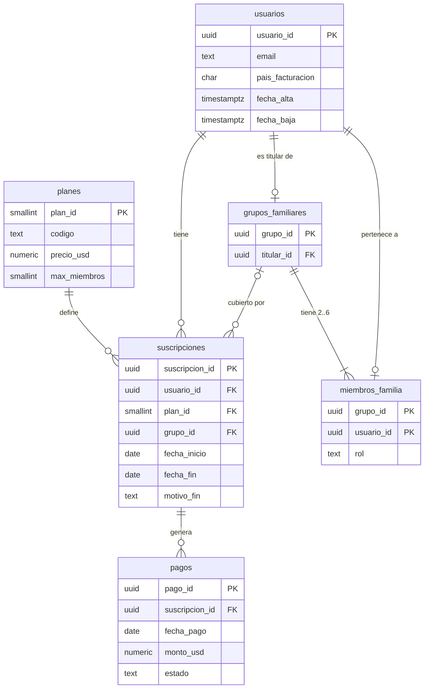

# Modelo F3 · Suscripciones (HU 04 · EG-13)

Fuente F3 de SonoraPlay: base PostgreSQL con usuarios, planes, cuentas familiares, períodos de suscripción y pagos. La leen RN-05 (bolsa por país), RN-09 (churn) y RN-10 (cuenta familiar = un solo ingreso).

## Diagrama ER

## Cómo leerlo

- Cada usuario tiene uno o más **períodos** de suscripción; solo el último puede estar abierto (`fecha_fin IS NULL`, índice único parcial `ux_suscripcion_activa`).
- Un plan familiar es **una sola suscripción** del titular ligada al grupo → un solo pago por familia (RN-10). Los miembros tienen fila en `usuarios` y en `miembros_familia`, pero no suscripción propia.
- Un cambio de plan cierra el período anterior con `motivo_fin = 'cambio_plan'` (no es churn, RN-09). `cancelacion` y `no_renovacion` sí son churn.
- `seed_defectos` registra cada defecto inyectado para medir después cuántos detecta la calidad de datos.

## Planes (supuestos)

| Plan | plan_id | Precio USD/mes | Máx. miembros | % de slots |
|---|---|---|---|---|
| free | 1 | 0.00 | 1 | 45 % |
| individual | 2 | 5.99 | 1 | 30 % |
| familiar | 3 | 9.99 | 6 | 10 % |
| estudiante | 4 | 2.99 | 1 | 15 % |

## Decisiones de diseño

| Decisión | Elección | Por qué |
|---|---|---|
| Llaves primarias | `uuid5(NAMESPACE, "semilla:entidad:índice")` | Re-ejecutar choca con la misma PK y `ON CONFLICT DO NOTHING` la descarta (idempotencia). |
| Aleatoriedad | Un `random.Random(f"{semilla}:slot:{i}")` por slot | Cambiar volumen o tasa de defectos no desplaza los demás datos; dev es prefijo exacto de completo. |
| Fechas | Referencia fija `2026-09-30` | `now()` rompería el checksum de reproducibilidad. |
| Máx. 6 miembros | Trigger `trg_max_6_miembros` | Un `CHECK` no puede contar filas de la tabla. |
| Defectos | Tabla `seed_defectos` + RNG propio | Trazabilidad y tasa configurable sin alterar el resto. |

## Pregunta abierta para el equipo

¿Un downgrade de plan pago a *free* es churn? RN-09 solo dice que los cambios de plan no lo son. El seed evita la ambigüedad generando solo cambios pago→pago y free→individual.

## Comportamientos a conocer

1. El volumen es un objetivo: la última familia puede sumar hasta 5 usuarios extra.
2. Otra semilla sobre una base cargada agrega un segundo conjunto de datos aparte.
3. Cambiar la tasa de defectos exige base vacía (`docker compose down -v`), porque las filas existentes no se actualizan.
