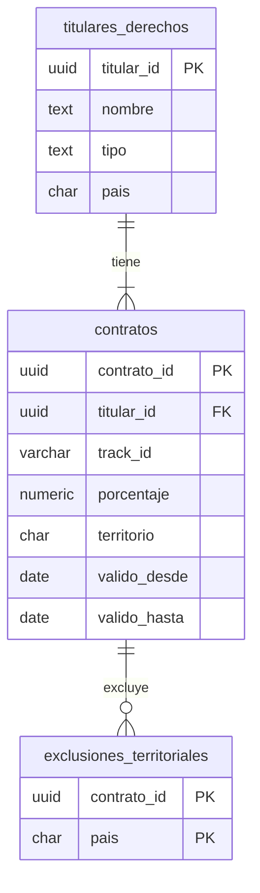

# Modelo F4 · Contratos (EG-14)

F4 modela las condiciones contractuales usadas para liquidar regalías. El seed **no inventa identificadores de negocio**: lee `titular_id` de `titulares.parquet` y `track_id` de `catalogo_f1.parquet`, ambos producidos por EG-12.

## Modelo

## Reglas

- **Integridad con F1:** cada titular y pista vienen de los Parquet de EG-12. **Cada pista** del catálogo recibe la condición general de su titular, para que la liquidación siempre encuentre un % (RN-06). Las condiciones se sortean por titular y se aplican a todas sus pistas.
- **RN-07 (vigencia):** algunos titulares cambian porcentaje a mitad de mes. El primer período termina el día 14 y el siguiente comienza el 15; PostgreSQL además impide solapamientos para la misma combinación titular/pista/territorio.
- **RN-08 (exclusiones):** algunos titulares excluyen un país en todos los períodos de la condición general, siempre el mismo. La exclusión se guarda separada para que EG-20/EG-23 puedan consultarla sin codificar listas dentro de una columna.
- **Porcentaje:** `CHECK (porcentaje BETWEEN 0 AND 100)`.
- **Q7 (supuesto):** `territorio IS NULL` es la condición general. Un territorio **agrega** una condición con su propio % para ese país, y en los demás países rige la general. La condición territorial no sustituye las exclusiones de RN-08.
- **Reproducibilidad:** semilla 42 por defecto y UUID5. La aleatoriedad se deriva de `semilla + titular_id`, por lo que una nueva ejecución produce las mismas filas.
- **Idempotencia:** las PK deterministas y `ON CONFLICT DO NOTHING` permiten reejecutar el seed sin aumentar los conteos.

Q7 sigue siendo un **supuesto del equipo pendiente de validación del instructor** (EG-11). Si la respuesta cambia, deben actualizarse modelo, seed, pruebas y las reglas de liquidación.

## Parámetros

`ContratosConfig` centraliza la semilla, fecha de inicio, fracción de titulares con cambio de porcentaje, fracción con exclusiones, fracción con condición territorial y rango permitido para los porcentajes. Esto evita valores de negocio dispersos por el código.

## Consumo futuro

EG-20 expondrá F4 mediante FastAPI + SQLModel. EG-23/EG-37 seleccionarán la condición vigente para la fecha de reproducción, aplicarán el porcentaje correspondiente y descartarán reproducciones cuyo país esté excluido.
